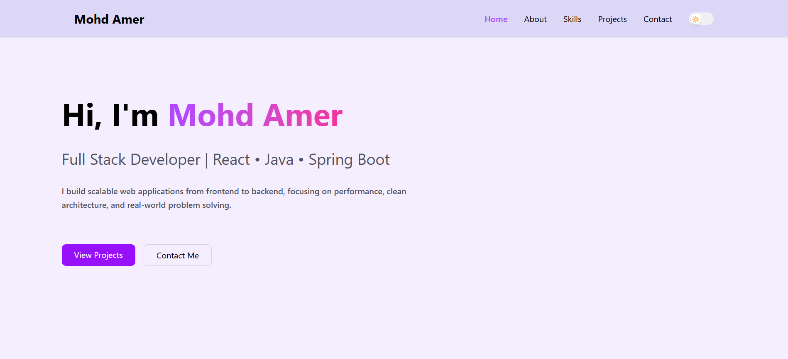

#  Mohd Amer | Portfolio




A modern, responsive developer portfolio built to showcase my projects, technical skills, and experience as a Full Stack Developer.

## 🌐 Live Demo

👉 https://themohdamer.github.io/

---

## 📖 About

This portfolio highlights my journey as a Full Stack Developer, featuring my projects, technical skills, and experience in building scalable web applications.

The website is fully responsive, supports both Light and Dark themes, and includes smooth animations for an engaging user experience.

---

## ✨ Features

- Responsive Design
- Light & Dark Mode
- Smooth Animations
- Mobile-Friendly Navigation
- About Me Section
- Skills Showcase
- Project Showcase
- Contact Section
- Clean Modern UI

---

## 🛠️ Tech Stack

### Frontend

- React.js
- Vite
- Tailwind CSS
- Framer Motion

### Tools

- Git
- GitHub
- GitHub Pages
- VS Code

---

## 📂 Project Structure

```text
portfolio/
├── public/
│
├── src/
│   ├── components/
│   │   ├── Contact.jsx
│   │   ├── Hero.jsx
│   │   ├── Intro.jsx
│   │   ├── Navbar.jsx
│   │   ├── ProjectModal.jsx
│   │   ├── Projects.jsx
│   │   ├── Section.jsx
│   │   ├── SectionCard.jsx
│   │   ├── SkillCard.jsx
│   │   └── ThemeToggle.jsx
│   │
│   ├── pages/
│   │   ├── Home.jsx
│   │   
│   │
│   ├── App.jsx
│   ├── main.jsx
│   └── index.css
│
├── .gitignore
├── eslint.config.js
├── index.html
├── package.json
├── package-lock.json
├── vite.config.js
└── README.md
```bash
git clone https://github.com/themohdamer/themohdamer.github.io.git
```

Navigate to the project

```bash
cd themohdamer.github.io
```

Install dependencies

```bash
npm install
```

Run the development server

```bash
npm run dev
```

---

## 📦 Build

```bash
npm run build
```

Preview production build

```bash
npm run preview
```

---

## 🚀 Deployment

This portfolio is deployed using **GitHub Pages**.

Deploy command

```bash
npm run deploy
```

---

## 📬 Contact

Email

**mohdamer2957@gmail.com**

GitHub

https://github.com/themohdamer

LinkedIn

**https://www.linkedin.com/in/mohdamer2957**
---

## 📄 License

This project is open source and available under the MIT License.